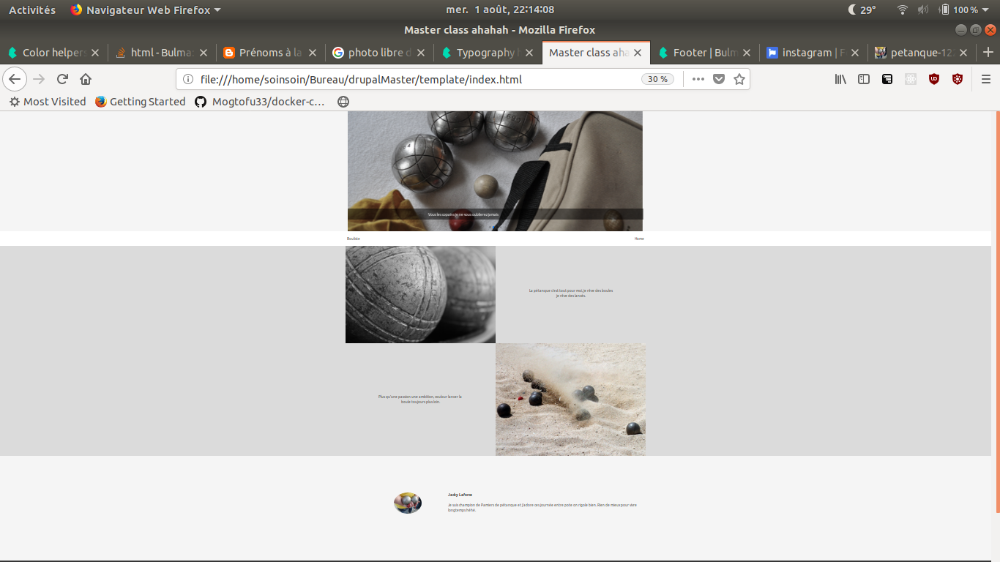
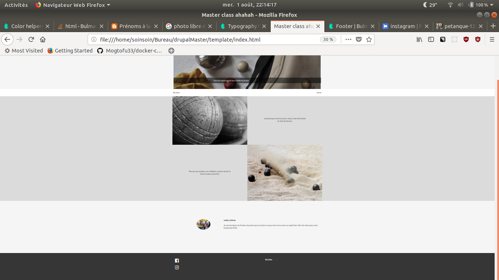

# Créer un template sous Bulma

### J'éspére que notre présentaion vous à plus, voici quelques consignes.

- Vous devrez reproduire le template fournis et montrer au video projecteur
- Vous aurez la matiné.
- Il est impératif de la terminer car il sera nécessaire pour la suite de l'exo.
- Vous devrez utiliser seulement Bulma
- Jquery est interdit.
- Je vous ai mis l'environnement de dev en place.
- Le slide doit être en autoplay.
- Libre a vous de changer de plugin js pour le slide tant que ce n'est pas du jquery.
- Pour la charte graphique éclaté vous.
- Faite le moins de css possible.
- Le menu doit-être sticky.
- Le logo vous est fournis (pétanque.png) et doit-être à gauche du nom du site.
- les slide sont des backgrounds-image.

has fun.

